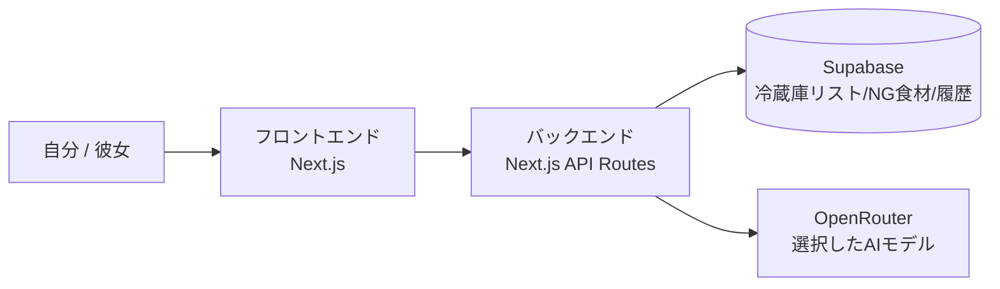
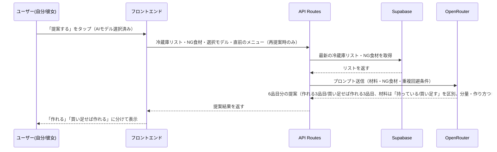
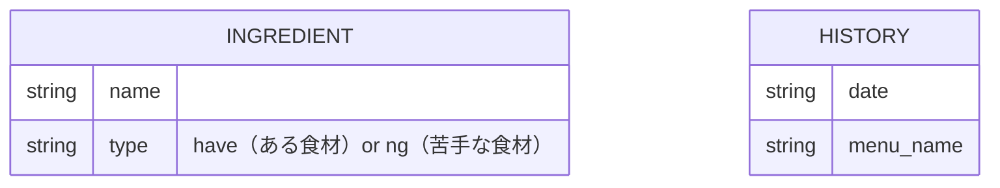

# think-dinner — 要件定義書・設計書

> 要件（何を作るか）と設計（どう作るか）をまとめて書く場所。実装コードそのもの（関数の中身・スキーマ全文・APIルートの中身等）は書き写さない。コードが変われば記録側は更新されず食い違って腐るため、詳細は`02.development/`のコード自体・READMEを参照する。該当しないセクションは書かない。

## 機能要件（必須）

### 冷蔵庫リスト管理
- 食材名を自由入力して冷蔵庫リストに追加できる
- 追加した食材はブラウザを閉じても消えず、次回開いたときも残っている
- 食材は個別に手動で削除できる（例：「豚肉」を削除しても「キャベツ」は残る）
- ログイン機能は無く、自分と彼女の両方が同じ冷蔵庫リストを閲覧・編集できる（共有の単一データとして扱う）

### NG食材登録
- 苦手な食材・使いたくない食材をあらかじめ登録できる
- AIへの献立提案の生成時、登録されたNG食材は除外される

### AI提案（献立生成）
- 冷蔵庫リストの食材をもとに、AIが6品目のメニュー名を提案する
  - うち3品目：現在の冷蔵庫の食材だけで作れるもの
  - うち3品目：食材を買い足せば作れるもの
- 画面では「作れる」グループと「買い足せば作れる」グループを分けて表示する
- 気になるメニューをタップすると、必要な材料（分量つき）と作り方が詳細表示される
- 提案結果が気に入らない場合、再提案（作り直し）を実行できる
- 分量は常に2人分固定として計算する（人数指定機能は持たない）
- 「提案する」ボタンの近くに、使用するAIモデルを切り替えられるUI（プルダウン等）を用意する
- 「買い足せば作れる」メニューでは、材料のうち「既にある食材」と「買い足す必要がある食材」を区別して表示する
- 再提案する場合、直前に提示したメニューと重複しないようにする

### 履歴機能
- 提案された6品目のうち、実際に作った（選んだ）メニューを記録できる
- 記録は日付とメニュー名がセットで、後から一覧で見返せる
- 選ばなかったメニューは記録しない

## 技術選定（任意・推奨）

- **フロントエンド**：Next.js + shadcn/ui。既存商品と同じ構成にして、慣れている部分は流用しつつ、今回新しい部分（AI連携・DB）に集中する。画面デザインの参考にVercelのv0を使う予定で、v0の生成コードがshadcn/ui前提のためそのまま採用した。
- **バックエンド**：Next.js API Routes。フロントと同一リポジトリで完結できるため。
- **DB**：Supabase（Postgres）。デプロイ先をVercelにするのに伴い、Vercel Postgres/KVが提供終了しているため、Marketplace経由で連携できる代替として選んだ。個人開発での実績も十分にある。ORM（Prisma・Drizzle等）は導入せず、Supabaseのクライアントを直接使う。テーブルが2つ・列も少ない単純なスキーマのため、ORMを挟む必要性が薄いと判断した。
- **AI/LLM**：OpenRouter。「AIモデルを切り替えて試したい」という学習目的をそのまま実現するために採用。似た位置づけのVercel AI Gatewayも検討したが、今回はOpenRouter自体を試したいのでこちらにした。
- **インフラ・デプロイ先**：Vercel。既存2商品はCloudflareだったが、今回はNext.jsの開発元が提供するVercelに変えて、Cloudflare×Next.js（OpenNextアダプタ経由）で過去に起きたような相性問題を避けつつ、新しい環境を学ぶ。
- **CI/CD**：GitHub Actions。既存2商品と同じ。

## アーキテクチャ（任意・推奨）

ログイン機能は無く、全データを共有の単一データとして扱う（ユーザーごとの区切りは持たない）。

### 全体構成

### AI提案の処理の流れ

## 画面設計（任意）

[Figma（think-dinner）](https://www.figma.com/design/CHdHRTzAMdQaZXhjhhlHIw/think-dinner?node-id=0-1&p=f&t=0ZVJlPRclIaztsPU-0)

## データ構造（任意・推奨）

### 永続化するデータ（Supabase）

「ある食材」と「苦手な食材」は同じ形のデータなので、テーブルを2つに分けず`type`列で区別する1つのテーブルにまとめる。両エンティティの間に外部キーの関連は無い（それぞれ独立したデータとして扱う）。

### 一時的なデータ（DBには保存しない、AI提案の結果）

`Menu { name: string, ingredients: { have: string[], needToBuy: string[] }, amount: "2人分", steps: string }` の配列（6件）。画面表示にのみ使い、履歴に記録する時は`name`だけを`History.menu_name`として保存する。

## Non-Goals・スコープ外（任意・推奨）

このバージョンでは扱わない範囲。

- LINE連携（買い物リストとの自動連携）
- メニューごとの画像生成
- 賞味期限・追加日の記録
- 人数分の指定（常に2人分固定で計算する）
